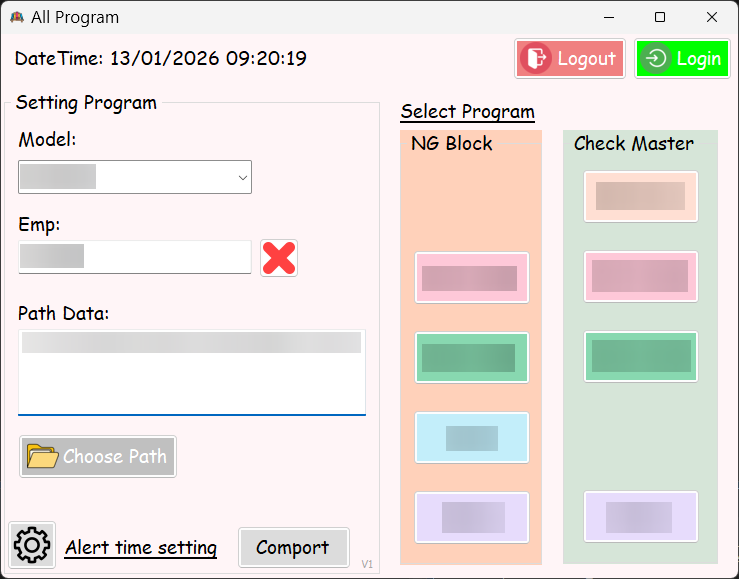
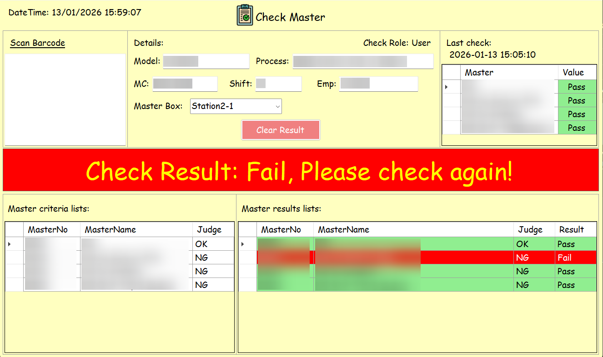
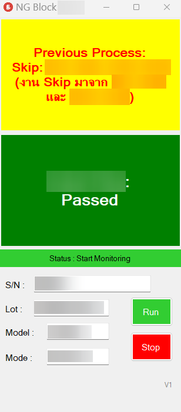
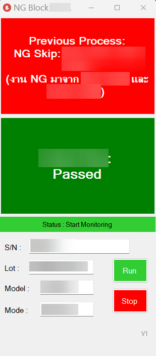
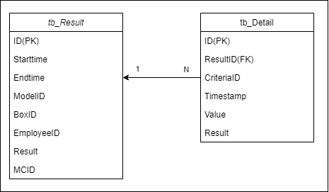
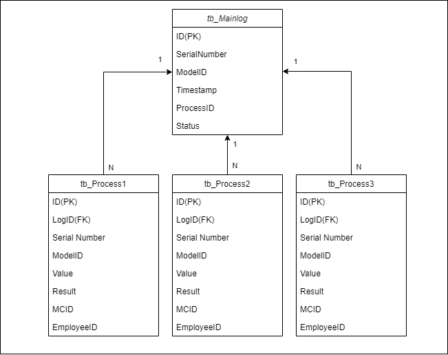

# Check Master and NG Block program

## 📌 Project Overview
&emsp; This project is a system design to verify the condition and pattern of master workpieces. If the verification fails due to out-of-spec measurements or an incorrent pattern, the program will lock machine and require authorization to unlock it. Addtionally, the system verifies the status of previous processes; if a workpiece is marked as NG (Not good) or has skipped a process, the program will alert the user.

### 🔒 Note on Source Code
> **Disclaimer:**
> This project was developed professionally for a private client / company.
> Due to Non-Disclosure Agreements (NDA) and proprietary rights, the **source code cannot be made public**.
> This repository serves as a **showcase** of the application's functionality, UI design, and my technical contributions.

*(แปลไทย: โปรเจกต์นี้ถูกพัฒนาขึ้นสำหรับบริษัท/ลูกค้า เนื่องด้วยสัญญาการรักษาความลับและลิขสิทธิ์ ซอร์สโค้ดจึงไม่สามารถเปิดเผยต่อสาธารณะได้ Repository นี้จัดทำขึ้นเพื่อแสดงฟังก์ชันการทำงาน ดีไซน์ และทักษะทางเทคนิคของผู้พัฒนาเท่านั้น)*

---

## 🖧 System diagram

---

## 📸 Screenshots & Demo

## 1. Main menu page

"Description: Main menu for selecting data and programs. It also allows authorized users to adjust settings (login required)."

## 2. Check master page

"Description: A master check interface to verify if the workpiece is within specifications and follows the defined pattern."

## 3. NG Block page
| All pass | Detect skip | Detect NG skip |
|:---:|:---:|:---:|
|  |  |  |
| *All previous processes passed.* | *A previous process was skipped* | *A previous process was NG* |

*Description: A program to verify that all previous processes were passed and to check the result of the current process.*

---

## 🛠 Tech Stack
* **Language:** C#
* **Framework:** .NET Framework / Windows Forms
* **Database:** Microsoft SQL Server (MSSQL)
* **Tools:** Visual Studio, Git

---

## ✨ Key Features (Current)
* ✅ **Setting Pre-Alert:** Set an alert for when it is time to check the master workpiece.
* ✅ **Hardware Integration:** Connect with IoT devices and communicate via a serial port
* ✅ **Read and create files:** Read data from files, filter the data to save in the database and create a summary result.
* ✅ **Check all previous process:** Check that the previous workpiece passed all previous processes to prevent skipping steps or passing defective (NG) items.
* ✅ **User Role Management:** Seperate access rights for certain program functions between `Admin`, `Engineer` and `Operator`

---

## 🚧 In Development & Roadmap
* [ ] **Phase 2:** Create Website to trace workpieces in each process
* [ ] **Phase 3:** Create Website to show if the master check was done on time.

---

## 🗄️ Database Architecture

### 📊 Schema Design Concept
* **Centralized Data:** Combine data from many production lines into one places.
* **Normalization:** Design tables using 3NF principles to reduce data redundancy.
* **Denormalized:** Store some duplicate data to make data retrieval faster and easier.

### 🧩 Diagram

*Description: ER Diagram for the Master Check System. Designed for data collection.*

*Description: ER Diagram for the NG Blocking system. Designed for data collection, workpiece traceability, and process validation.*

### 🚀 Performance & Scalability features
* **High Frequency Logging:** Designed to handle high-volume, concurrent data insertion from multiple machines simultaneously.
* **Smart Indexing:** Implemented `index` on frequently queried columns (e.g., Serial No., Date, Model) to optimize historical data retrieval speed.
* **Stored Procedures:** Migrated complex logic to the server side to minimize network traffic.

### 🔒 Security Implementation
* **Dedicated Database User:** Avoided using the `sa` (System Admin) account by creating a dedicated user account specifically for the application's connection.
* **Least Privilege Principle:** Restricted database permissions to essential CRUD Operations (Create, Read, Update, Delete) only, preventing unauthorized changes to the table structures or schema.
* **Stored Procedure Access:** Managed data access primarily via EXECUTE permissions on Stored Procedures to hide table structure and prevent SQL Injection risks.

---

## 💡 Technical Challenges & Solutions
* **Challenge:**
    * Managing high-frequency workpieces data from machine. 
    * Developing a single program adaptable to multiple production processes.
    * Connecting IoT devices to the software to read data and send electrical signals back to the machine.
* **Solution:** 
    * Designed the database to handle high-speed writing and used Stored Procedures to process data on the server (reducing the load on the C# app).

---

## 📬 Contact Me
* **Name:** Pawarade Liangkobkij
* **Email:** l.pawarade@gmail.com"# My Project Name" 
